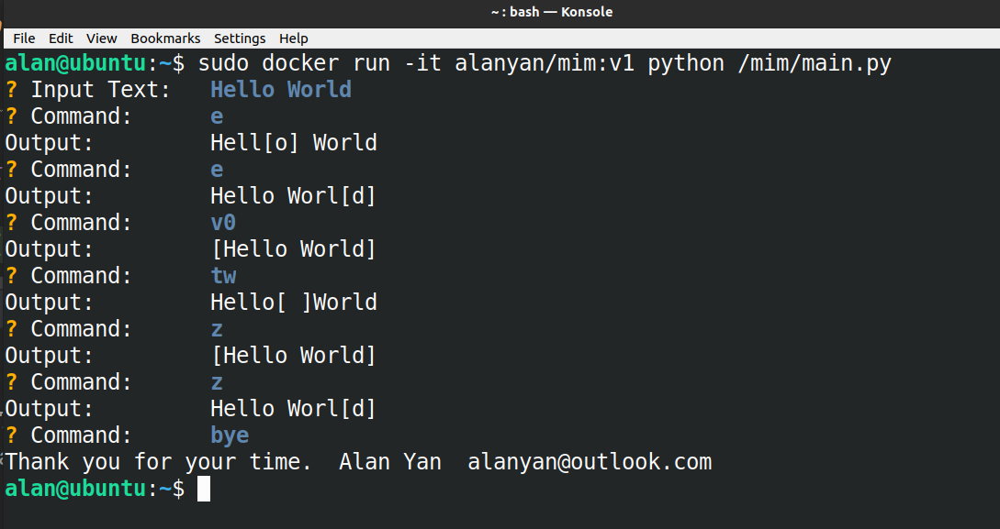

# A simple VIM implementation

Commands:
1. Navigation: `0, $, e, t[char]`
2. Selection: `v[navigation command]`
3. Revert to last operation:  `z`
4. Exit: `bye`

Example interactions:

## Run mim app in docker container:

- pull image 
`docker pull alanyan/mim:v1`
 
- run app in a container 
`docker run -it alanyan/mim:v1 python /mim/main.py`
 
- clean up 
remove alanyan/mim containers 
`docker ps -a | grep "alanyan/mim" | awk '{print $1}' | xargs docker rm`
remove alanyan/mim images
`docker images -a | grep "alanyan/mim" | awk '{print $3}' | xargs docker rmi`

